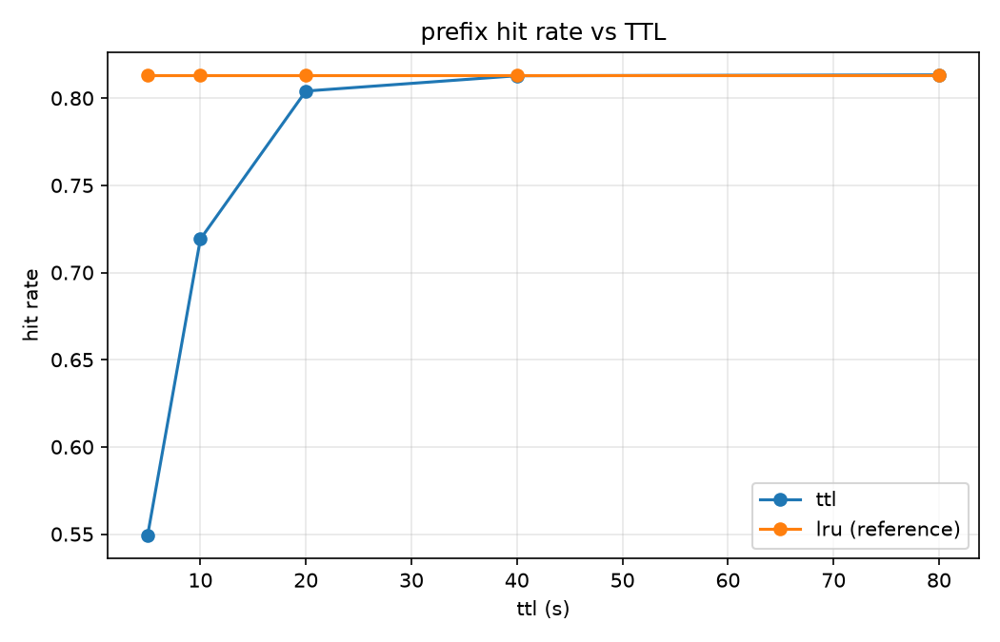
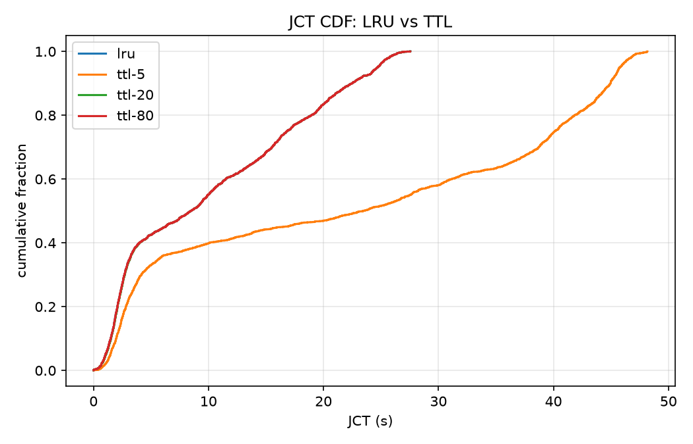
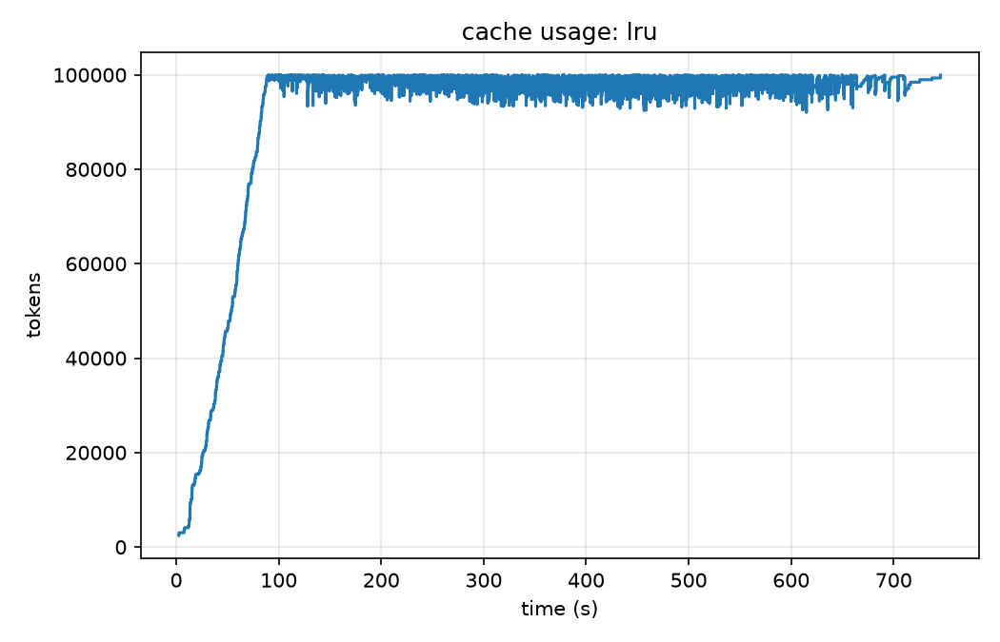

# Agent 负载下的 KV Cache 模拟器（一）：设计、实现与第一组实验

> 这是 agent-serving-sim 系列第一篇。项目目标：一个开源、可复现的 LLM agent 负载推理服务模拟器——trace 进，模拟 KV cache / 调度 / 淘汰策略，JCT、命中率、显存曲线出。
>
> 代码：<https://github.com/Naloam/agent-serving-sim>　|　本篇对应里程碑 M1，所有数字可用 `python experiments/exp001_lru_vs_ttl.py --seed 42` 复现。

## 1. 问题：agent 负载和聊天负载不是一种负载

2025 年之后，推理服务的请求来源正在从"人"变成"agent"。这件事对 KV cache 管理的影响比多数人直觉的大：

- **多轮长会话**：一个 coding agent 跑一个任务动辄几十轮调用；
- **轮间存在长空闲**：agent 在"思考"或执行工具（跑测试、读文件、调搜索），两轮请求之间隔几秒到几百秒；
- **前缀高度重复**：system prompt + 工具定义（几 KB 到几十 KB）在同一 agent 的所有请求中逐字节相同；
- **历史逐轮增长**：第 N 轮的 prompt = 前导 + 前 N-1 轮的全部对话，且这段前缀恰好是上一轮刚算完的 KV。

SGLang 的 RadixAttention 用 radix tree 组织前缀缓存已经解决了"能不能复用"；**没解决好的是"留还是不留"**——留着，下一轮命中省一次全量 prefill；不留，显存被长空闲会话占着，挤压并发。TTL（Continuum/CacheTTL）、优先级驱逐（TensorRT-LLM）、多 agent 配额（TokenCake）都是对这个问题的回答，但**这些论文的模拟器和 trace 基本都不开源**，复现和横向对比很困难。

所以我写了这个模拟器：CPU 上跑、纯 Python、10 万请求 19 秒，希望成为这个方向的一个公共基线。

## 2. 设计：三个关键取舍

### 2.1 自研离散事件内核，而不是用 simpy

事件循环是推理服务调度的本质抽象（vLLM 的 scheduler 就是个循环）。自研一个 heapq 优先队列（`Event` 按 `(time, priority, seq)` 定序，支持惰性 cancel 与 `run(until)`）只有约 150 行，换来的是对调度语义的完全掌控和零依赖。仿真中的"时间"是纯虚拟量，测试不需要 sleep。

### 2.2 radix tree 的元素是"位置对齐的段"，不是 token

这是全项目最重要的一个工程决策。FR 要求 radix tree 支持**共享前缀分裂**和**引用计数保护**——这要求树操作在真实的前缀序列语义上进行。但 10 万请求 × 平均 4K token 的逐 token 操作在纯 Python 里是 4×10⁸ 次对象操作，跑不完。

观察：agent 负载的前缀共享结构天然是**分段**的——

```
[agent 前导流: system+tools]  [会话对话流: 逐轮追加的 new+output]
```

同一 agent 类型的前导逐字节相同（同一应用）；会话对话流按位置对齐（第 N 轮的历史就是流的前缀）。于是树的元素定义为 `Segment(stream, length)`：同 `stream` 的任意短段是长段的前缀，不同 `stream` 在交界处分叉。每请求只有 2 个段，树的分裂/合并/部分命中语义与 token 级完全同构，复杂度却与 token 数无关。

对照 SGLang 的 `radix_cache.py` 读源码时会发现：它的 `_split_node`、lock_ref、leaf-only evict 语义在这个抽象下都能一一对应——这是写模拟器附赠的理解红利。

### 2.3 解析式计时，不模拟真实计算

prefill 时间 = 未命中 token 数 / prefill 吞吐，decode 时间 = 输出 token / decode 吞吐。模拟器的定位是**策略相对收益对比**，不是绝对性能预测；吞吐参数后续用真实服务（本机 4060）标定。

在此之上，驱逐策略是可插拔的：统一接口 `select_victims(tree, need_tokens, now)`，FIFO/LRU/TTL/Priority 内置，新策略 = 一个类 + 一个注册点，不改内核。

## 3. 一个实现中踩掉的方法论坑：TTL ≠ "按过期排序的 LRU"

最初我把 TTL 实现为"缺空间时优先淘汰过期条目，LRU 兜底"。写完后推演发现：**过期集恰好是按 last_access 排序的尾部**，所以这种"排序式 TTL"的 victim 集合与纯 LRU 完全同构——TTL 扫描实验会得到一条平线，白做。

正确的 TTL 语义必须是**主动清除**：条目距上次访问超过 TTL 即从树中移除，之后到达的请求不能命中它。这样 TTL 才与 LRU 产生真正的行为差异：LRU 允许"任意久之前的条目只要没被挤掉就还能命中"，TTL 不允许。

## 4. exp001：同构负载下的 LRU vs TTL

**设置**：300 会话 × 8 轮 = 2400 请求；会话泊松到达（0.5/s）；think_time 对数正态（μ=2.0, σ=1.0，中位数 ≈7.4s）；缓存容量 100K token；并发上限 8。同一份 trace（seed=42）分别跑 LRU 与 TTL ∈ {5, 10, 20, 40, 80}s。

| policy | hit_rate | JCT mean (s) | JCT p95 (s) | 驱逐次数 | TTL 清除 token |
|--------|----------|--------------|-------------|----------|----------------|
| lru    | 0.813    | 10.05        | 24.69       | 2308     | —              |
| ttl-5  | 0.549    | 22.31        | 45.74       | 0        | 4.85M          |
| ttl-10 | 0.719    | 13.56        | 30.59       | 88       | 3.19M          |
| ttl-20 | 0.804    | 10.06        | 24.69       | 1913     | 0.46M          |
| ttl-40 | 0.813    | 10.05        | 24.69       | 2282     | 0.10M          |
| ttl-80 | 0.813    | 10.05        | 24.69       | 2308     | 0.03M          |





**读数**：

1. **TTL 单调趋近 LRU，且始终不超过它**。TTL=5s（小于轮间隔中位数）时命中率崩到 0.55、JCT 翻倍；TTL=80s 时与 LRU 完全一致。
2. 这不是 bug，是这个负载下的**结构性结论**：think_time 同分布时，"过期集 ⊆ LRU 尾部"意味着 TTL 只会额外放弃 LRU 本可保留的命中（晚归会话的迟到重命中），换不来任何额外收益。
3. 那论文里"TTL 存在最优值"的结论从哪来？来自**异构**：当不同 agent 的轮间隔分布不同（coding agent 秒级回转、搜索 agent 分钟级回转），一个设置得当的 TTL 可以把长间隔会话的"死缓存"及时让给短间隔会话——这是 M3 要用按类型差异化的负载验证的命题，也是优先级驱逐和多 agent 配额的同一动机。

显存时间线（LRU，阶梯 = 逐轮增长的历史 + 驱逐）：



## 5. 工程数字

- 全量单测 81 个（事件内核、radix 分裂/引用保护、四种策略、serving 手算核对、schema 往返、生成器统计量）；
- 10 万请求端到端 **19.0s**（生成 0.4s + 仿真 18.6s），满足"普通笔记本 CPU 一分钟内"的设计目标；
- 核心包（core/workload/cache/scheduler）零第三方依赖，numpy/matplotlib 只在 viz 层。

## 6. 下一步

- **M2**：在本机 4060 上起真实推理服务，写探针拦截 OpenAI 兼容流量，采集真实 coding/search agent 的会话 trace，做负载刻画（think_time 分布、前缀共享率、轮长增长）；
- **M3**：异构负载下的 TTL 参数扫描（验证最优 TTL 的存在性）、按 agent_type 的优先级驱逐、多 agent cache 配额，并用真实 trace 重跑 + 标定计时模型。

下一篇写真实 trace 采集与负载刻画。如果你在做类似方向，欢迎交流：模拟器和 trace 都会开源。
