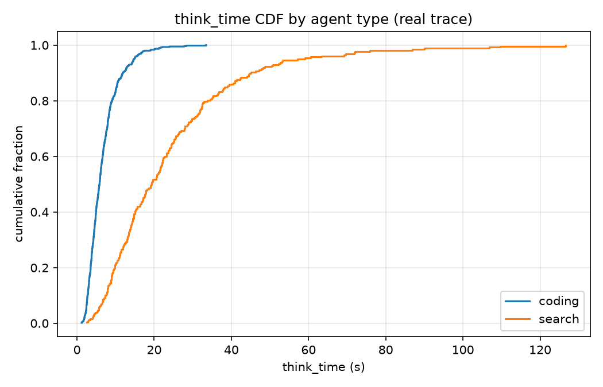
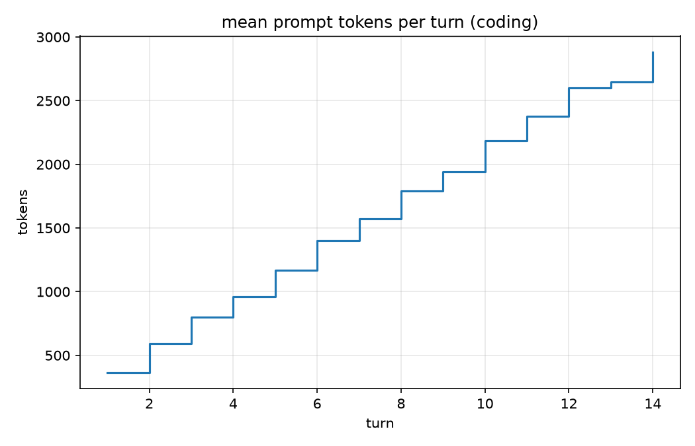
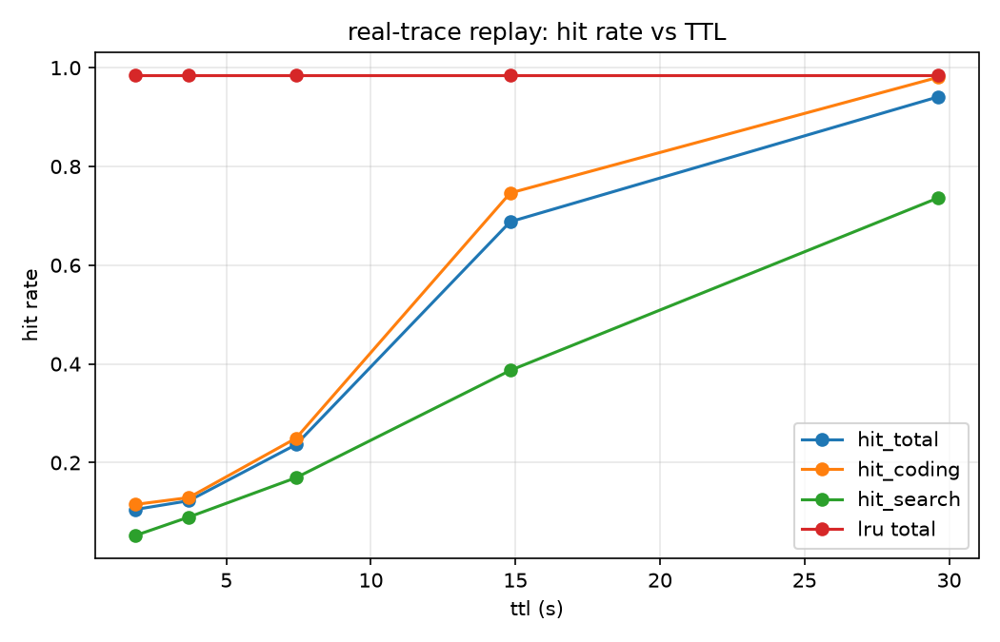

# Agent 负载下的 KV Cache 模拟器（二）：真实 trace 采集、两个数据管线的坑、与一份真实负载刻画

> 系列第二篇，对应里程碑 M2。上一篇用合成 trace 得到了模拟器的第一组结论；这一篇解决那个领域最稀缺的东西——**一份开源的真实 agent 负载 trace**（1021 个请求 / 162 个会话 / 两类 agent，采集脚本与数据全部入库）。

## 1. 为什么必须采真实 trace

合成负载的每一个"合理假设"都可能是结论翻转的开关：think_time 的分布形状、前缀各段的占比、轮长的增长方式，都直接影响"TTL 设多少最优"这类结论。文献里针对 agent 负载的论文（Continuum、KVFlow、TokenCake、ForeCache）几乎都不放 trace；社区反复在问"有没有公开的 agent serving trace"。所以 M2 的目标只有一个：在本机把真实流量跑出来、记下来、刻画清楚。

## 2. 采集系统：一个探针、两类假 agent、一块 4060

### 2.1 探针（约 300 行标准库）

`ass/probe/proxy.py` 是一个 OpenAI 兼容的**记录代理**：agent 把 `base_url` 指向它，它原样转发给上游（Ollama/vLLM/任何兼容端点），响应逐字节透传、**绝不阻塞请求**，同时在响应完成后把每个请求的原始事实追加写 JSONL：

- 三个墙钟时间戳：请求到达 / 首字节 / 完成；
- 自定义头 `x-ass-session-id` / `x-ass-agent-type` 标记会话与类型；
- 原始 `messages` / `tools` 与上游 `usage`（精确 token 数）。

探针只记事实，不做解释——所有清洗对齐留给离线的 loader，这个分层在后面救了我们（见 §3）。

### 2.2 驱动器：不是 mock，是"带工具调用回路的真 LLM 会话"

`experiments/collect_real_trace.py` 驱动两类 agent（模型：qwen2.5-coder-7b，4060 上 Ollama 服务）：

- **coding agent**：系统提示词描述一个 Python 仓库，配 `run_tests` / `read_file` / `write_file` 三个工具。模型真的会发起工具调用，驱动器返回**合成的**工具结果（测试输出、文件内容、写入回执），把对话滚下去。轮间空闲（think_time）用真实 sleep 模拟 agent 侧处理，对数正态分布、中位数 ~5s；
- **search agent**：配 `web_search` 工具，返回合成 SERP 摘要（会进入历史、逐轮膨胀 prompt），think_time 中位数 ~20s。

会话按泊松过程错峰启动、4 路并发争抢同一块 GPU——多租户的排队效应被真实地记录进时间戳里。

一个部署细节：Ollama 的 OpenAI 端点不接受 `num_ctx`，默认 4096 会**静默截断**长会话的前缀（对前缀复用研究是致命的）。解法是用本地 blob 派生一个 `PARAMETER num_ctx 16384` 的模型变体（`ollama create`，零下载）。

两批共采集 **1021 个请求**（coding 702 / search 319，162 个会话），墙钟约 70 分钟。

## 3. 两个数据管线的坑（本文最有传播价值的部分）

原始日志 ≠ trace。把 OpenAI 消息流转成"四段前缀分解 + 轮间空闲"的结构化 trace 时，我们踩了两个坑，**每个都会让下游实验得出完全错误的结论**：

**坑一：逐请求独立估算 token，前缀 silently 断裂。** 第一版 loader 对每个请求按各段字符占比独立分摊 `usage.prompt_tokens`。问题在于：同一段 system prompt 在不同轮的估算值会差几个 token（126、132、125……）。对模拟器而言，这等于"每轮的 system prompt 都不一样"——radix tree 上对话流永远接不上，重放命中率从理论 ~0.99 塌缩到 0.42。修复：**前导（system+tools）按 agent 类型一次定型；对话流累计记账**（`history(t+1) = history(t) + new(t) + output(t)`，`new` 用 `usage` 减出残差吸收噪声）。修复后命中率回到 0.9855。

**坑二：匿名请求污染类型级前导。** 采集脚本启动时发了一个无会话头的预热请求，被默认归类为 coding——它没有 system 段，于是整个 coding 类型的前导被定型为 0。修复：只有带会话标识的请求才有资格定型类型参数。

教训写成一句话：**凡是"按内容估算再下游对齐"的管线，都要显式维护跨请求的一致性不变量，并用不变量断言做测试**（我们补了 `history(t+1) == history(t)+new(t)+output(t)` 的单测）。

## 4. 一份真实 agent 负载的刻画

修复后的数字（`traces/real/REPORT.md`，全部可由 `python experiments/analyze_real_trace.py` 复现）：

| 指标 | coding | search |
|------|--------|--------|
| 请求 / 会话 | 702 / 100（平均 7.0 轮） | 319 / 62（平均 5.1 轮） |
| think_time 中位数 | 5.8 s | 19.3 s |
| think_time p95 | 14.7 s | 57.2 s |
| 对数正态拟合 | μ=1.75, σ=0.56 | μ=2.92, σ=0.72 |
| prompt 均值 | 1182 tok | 503 tok |
| 前导占比（system+tools） | 29% | 37% |
| 历史占比 | 62% | 59% |
| 逐轮 prompt 增长 | 366 → 2882 tok（14 轮） | 208 → 1313 tok（10 轮） |

三个刻画结论：

1. **轮间空闲是双峰的、类间差 3.3 倍**（5.8s vs 19.3s），且各自良好服从对数正态——"TTL 应当设在两类的回转周期之间"这个直觉有了参数依据；
2. **历史是 prompt 的主体**（~60%）且逐轮近线性增长——agent 负载的 KV 压力主要来自会话自身的历史累积，而非 system prompt；
3. **前导 ~30%**：跨会话可共享的部分不可忽略但不是大头——纯 preamble 缓存（不管会话）的天花板有限。

## 5. 计时标定：能标到什么程度，就老实说到什么程度

用 1021 个请求的（prompt_tokens, completion_tokens, 总时延）做最小二乘：

- **prefill ≈ 3913 tok/s，decode ≈ 51.8 tok/s，固定开销 2.7 s，R² = 0.32**。

decode 速率与 4060 Laptop 上 7B-q4 的公开实测吻合；但 R² 只有 0.32——因为总时延里混着 4 路并发下 Ollama 内部的排队，而排队与"自身 token 数"弱相关。**诚实的结论是：非流式采集只能标定到这个精度**；要分解 TTFT/排队，需要流式首 token 时间戳（探针已支持 SSE 记录，留作下一轮采集）。

## 6. 用真实 trace 重放策略实验

`exp005`：把清洗后的 1021 个请求按原始到达时间重放进模拟器（标定参数），扫 TTL：

- LRU 命中率 **0.9855**（接近理论上限 ~0.99，损失主要来自每会话首轮）；
- TTL 从 1.9s 扫到 29.6s（= 0.25×~4× 全局 think 中位数 7.4s），命中率 0.105 → 0.941 单调逼近 LRU——**上一篇的结构性结论（TTL ≤ LRU、拐点在回转周期附近）在真实负载上复现**；
- 另一个诚实的发现：这份采集负载（~4 并发会话）的**活跃工作集远小于 60K token**，60K 与 200K 容量的重放结果逐位相同——容量压力场景需要更高的并发或更小的显存，这正是合成实验（exp002-004）的价值所在。

## 7. 交付物与复现

- 数据：`traces/real/coding.jsonl`（702）、`traces/real/search.jsonl`（319）、原始日志 `traces/real/raw/probe.jsonl`（4.8 MB）、`REPORT.md`、`calibration.json`；
- 复现一条龙：`collect_real_trace.py`（采集）→ `analyze_real_trace.py`（刻画入库）→ `exp005_real_trace_replay.py`（重放）；
- 采集环境：Ollama 0.31 + qwen2.5-coder-16k（本地派生变体），RTX 4060 Laptop 8GB。

下一篇（三）：把 TTL / 优先级驱逐 / 多 agent 配额三组策略实验讲完——包括一个有点反直觉的结论：**在你家里的这种"驱逐零成本"模拟器里，LRU 在均值意义上几乎不可战胜**。

如果你在做 agent infra，这份 trace 和采集管线可以直接拿来用——欢迎交流。
