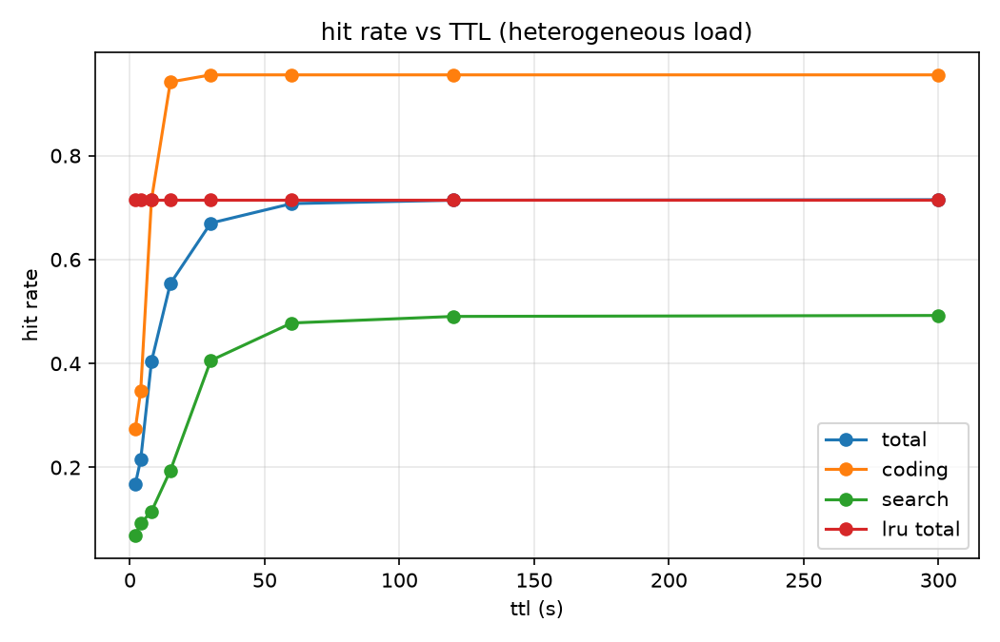
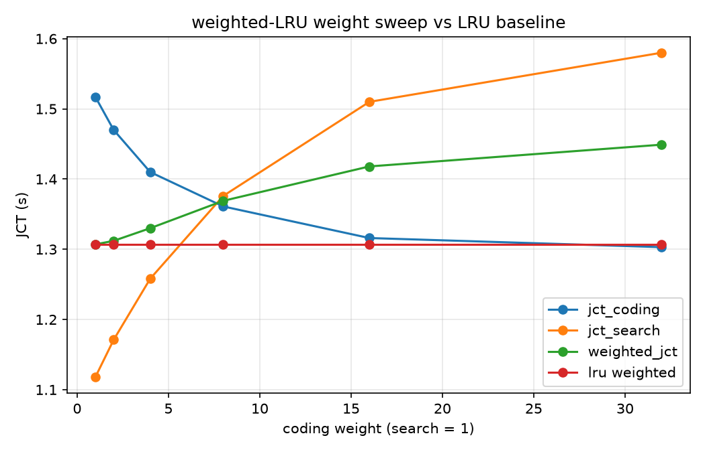
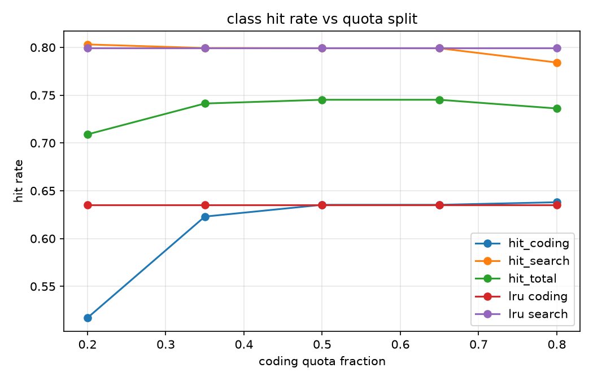

# Agent 负载下的 KV Cache 模拟器（三）：TTL、优先级驱逐、多 agent 配额——以及"LRU 几乎不可战胜"

> 系列第三篇，对应里程碑 M3。三组实验（exp002~005，合成 + 真实 trace 双重验证）得到一个统一的图景：**在驱逐零成本的模拟器里，LRU 在命中率与均值 JCT 上几乎不可战胜；但三类"高级策略"各有不可替代的工程角色**。本篇讲清楚为什么，以及文献结论与模拟器结论为何不同。

## 0. 实验设置速览

- 负载生成器支持按 agent 类型差异化（`AgentProfile`）：exp002 用"coding 快回转（think 中位 5s）+ search 长思考（30s）"，exp003/004 故意**倒置**（高价值 coding 回转慢 30s、低价值 search 回转快 5s），让 LRU 的 recency 直觉保护"错误的"类别；
- 容量 80K token（受压），2100 请求，seed 固定；
- 真实 trace 重放（exp005）见第二篇：1021 请求、标定参数（prefill 3913 tok/s / decode 51.8 tok/s）。

## 1. TTL：一个结构性定理和工作点拐点

**结论（exp002，异构负载；exp005 真实 trace 复现）：TTL 的命中率与 JCT 全程不超过 LRU，随 TTL 单调趋近，但存在一个有工程意义的"拐点工作点"。**

这不是参数没调好，而是可以在模拟器里证明的结构性质：

> TTL 的过期集 = {距上次访问超过 ttl 的条目}，这个集合恰好是**按 last_access 排序的一个后缀**。LRU 在缺空间时驱逐的也正是这个后缀的开头。所以"TTL 主动清除 + LRU 兜底"的 victim 集合不可能比 LRU 更省——TTL 唯一的额外自由度是**放弃 LRU 本可保留的迟到重命中**（空闲超过 ttl 的条目，LRU 留着、TTL 清了），这个自由度只会减分。

| policy | hit_total | hit_coding | hit_search | 备注 |
|--------|-----------|------------|------------|------|
| lru | 0.7152 | 0.9554 | 0.4924 | 基线 |
| ttl-15 | 0.5538 | **0.9417** | 0.1941 | coding 保持 LRU 的 98.6% |
| ttl-30 | 0.6702 | 0.9554 | 0.4058 | coding 追平 LRU |
| ttl-300 | 0.7152 | 0.9554 | 0.4924 | ≡ LRU |



**拐点的工程意义**：TTL = 15~30s（介于两类回转周期 5s/30s 之间）时，快回转类的命中率保持在 LRU 的 98.6%+，同时慢回转类的"死缓存"被持续释放（ttl-15 提前清掉 3.9M token）——**用 ≤2% 的命中率损失换显存占用的可预测性与更低的驻留压力**。真实 trace 上同样形态：拐点在 2×~4× 全局 think 中位数处（29.6s → 0.941 vs LRU 0.986）。

那 Continuum/CacheTTL 论文里"TTL 优化 JCT"的收益从哪来？来自本模拟器**刻意不建模的二阶效应**：真实系统的驱逐要拿锁、要扫 radix tree（Continuum 的动机之一正是免锁的到点释放）；显存耗尽时 vLLM 会**抢占运行中请求**（recompute/swap），主动释放 idle KV 能避免抢占；以及多实例路由下的容量规划。模拟器把一阶效应干净地隔离出来之后，看到的图景是：TTL 不是用来"赢 LRU"的，是用来**买确定性**的。

## 2. 优先级驱逐：均值上赢不了，但它是 SLO 再分配的手术刀

exp003 的负载里 LRU 会偏袒低价值的快回转类（它们总是更"新"），与价值方向相反——理论上优先级驱逐有收益空间。实测（价值权重 coding:search = 2:1）：

先说一个实现层的发现：朴素 PriorityPolicy（按类权重严格排序）的**权重只有序数意义**——比值从 1.5 到 5 结果完全相同。为此我们实现了 `WeightedLRUPolicy`（有效年龄 = 空闲时长 / 类权重），它是 LRU（w=1）与严格类优先（w→∞）之间的**平滑插值**，扫出来的 Pareto 前沿：

| policy | jct_coding | jct_search | coding p95 | weighted JCT |
|--------|-----------|------------|-----------|--------------|
| lru | 1.517 | 1.118 | 2.528 | **1.307（最优）** |
| wlru-w4 | 1.410 | 1.258 | 2.357 | 1.330 |
| wlru-w16 | 1.316 | 1.510 | 2.270 | 1.418 |
| wlru-w32 | 1.303 | 1.580 | 2.215 | 1.449 |
| 严格优先 | 1.301 | 1.606 | 2.215 | 1.462 |



**两个读数**：

1. **均值加权 JCT 的最优点在 w=1（就是 LRU）**。快回转类的请求频率高（2/3），把它的缓存让渡给慢回转类，均值上得不偿失——即使后者单位命中更值钱；
2. **高价值类的 p95 随 w 单调改善（2.528 → 2.215，−12%）**，代价是低价值类 p95 恶化 53%。优先级驱逐的真实角色是**类间 SLO 的再定价**：用可控的低价值类尾部恶化，买高价值类的尾部确定性。这正是 TensorRT-LLM 提供 eviction priority API 的场景——不是让平均更快，是让该快的更快。

## 3. 多 agent 配额：一份隔离保险，不是提速器

exp004（同一倒置负载，QuotaPolicy 软配额扫描 coding 占比 0.2~0.8）：

| policy | hit_coding | hit_search | weighted JCT |
|--------|-----------|------------|--------------|
| lru | 0.6353 | 0.7991 | **1.307（并列最优）** |
| quota-0.20 | 0.5171 | 0.8031 | 1.369 |
| quota-0.35~0.65 | ≈ LRU | ≈ LRU | ≈ LRU |
| quota-0.80 | 0.6380 | 0.7842 | 1.313 |



配额在中段与 LRU **完全重合**——因为 LRU 在这种负载下本来就没有跨类侵占（recency 已经把快类挡在门外）；配额低于一类的工作集时（0.2）反而主动伤害该类。**配额的价值是"保险"**：当未来出现 LRU 无法预见的侵占模式（突发批量任务、恶意租户、缓存投 flooding），配额提供硬隔离下限。TokenCake 类工作的卖点应当在这个场景下评估——平静负载下它和 LRU 没有区别，这本身就是个值得写进论文 control 组的观察。

## 4. 统一的图景

把三组实验放在一起，一个反直觉但自洽的结论：

> **在"驱逐零成本、开环到达、容量只在请求到达时施压"的一阶模型里，LRU 是均值意义下的强基线，三类高级策略都赢不了它。** 它们各自的工程角色是：TTL 买显存确定性（拐点 = 类间回转周期之间）；优先级驱逐做 SLO 再分配（尾部）；配额做隔离保险（对抗非常规侵占）。

文献中这些机制的量化收益，大部分来自二阶效应（锁开销、运行中请求抢占、多实例路由、准入控制）。这提示两件事：一是复现论文结论前先问清它的模拟器建模到几阶；二是模拟器的下一步是把这些二阶效应补进模型——最重要的是 **decode 期 KV 增长 + 容量耗尽时的抢占**（vLLM 式 recompute），那才是 TTL 类策略真正的主战场。这些已记入 Future Work。

## 5. 复现

```bash
python experiments/exp002_ttl_sweep_heterogeneous.py --seed 42   # TTL 扫描（异构）
python experiments/exp003_priority_eviction.py --seed 42        # 带权 LRU 权重扫描
python experiments/exp004_multi_agent_quota.py --seed 42        # 配额扫描
python experiments/exp005_real_trace_replay.py                  # 真实 trace 重放
```

全部脚本 `--seed` 固定默认值，图与 CSV 产出到 `experiments/results/`。

下一篇（四）会把模拟器开源整理（英文 README、示例 notebook、上游 PR 计划）。数据、代码、blog 三件套都会放出，欢迎来踩。
