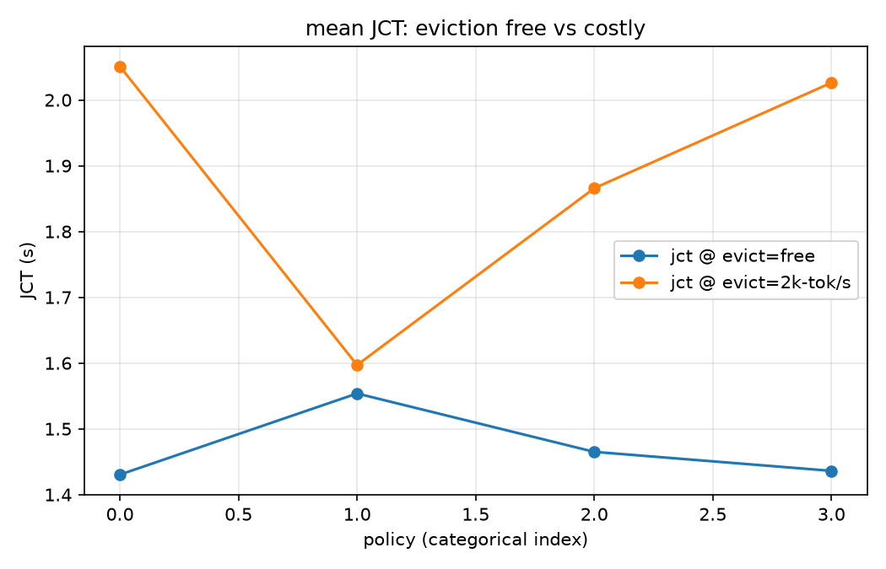

# Agent 负载下的 KV Cache 模拟器（四）：驱逐成本翻转了 TTL 的故事——以及一次 R²=0.999 的意外

> 系列第四篇，对应里程碑 M3.5（抢占与驱逐成本建模，FR-13）。第三篇留了一个悬念：一阶模型里 TTL 赢不了 LRU，文献收益到底从哪来？这篇把两个二阶效应建进模拟器，答案落地了：**驱逐一旦不免费，TTL 就翻盘**。

## 1. 补上两个二阶效应

第三篇论证过：驱逐免费的模拟器里，TTL 的 victim 集合不可能优于 LRU。真实系统里被这个抽象抹掉的两个东西：

1. **decode 期 KV 增长与抢占**（vLLM 语义）：KV 不是准入时一次性占满，而是随 decode 逐块增长；增长遇容量耗尽时，先驱逐 idle，无可驱逐就**抢占**在途请求——受害者 KV 丢弃、回队重算，重算成本进 JCT；
2. **驱逐成本**：按需驱逐要拿锁、扫 radix tree、回收块——这些 token/s 计入**触发请求的关键路径**；而 TTL 的到点清除发生在事件间隙、**不在任何请求的关键路径上**（对应 Continuum 强调的免锁定时释放）。

实现上：`decode_chunks=4` 打开分块增长 + 抢占（每请求被抢上限 3 次，超限转不缓存保活）；`evict_tps=2000` 给驱逐计费。抢占路径配了手算核对单测（受害者回队后 JCT 含重算成本，逐事件对齐）。

## 2. exp006：翻盘时刻

异构负载（coding 快回转 5s + search 长思考 30s，与 exp002 相同），容量 80K，seed=42：

| 驱逐模式 | policy | hit_rate | JCT mean | JCT p95 | 关键路径驱逐量 |
|----------|--------|----------|----------|---------|----------------|
| 免费 | lru | 0.716 | **1.430** | 2.396 | —（无成本） |
| 免费 | ttl-60 | 0.709 | 1.436 | 2.396 | — |
| 2k tok/s | lru | 0.716 | 2.051 | 5.973 | 2.70M tokens |
| 2k tok/s | ttl-15 | 0.554 | **1.597** | **2.647** | 0.18M tokens |



三个读数：

1. **驱逐免费时结构性结论原样成立**（LRU 1.430 vs 最优 TTL 1.436）；
2. **驱逐计费后 TTL-15 翻盘**：JCT −22%、p95 −56%。机制完全可解释：LRU 为 270 万 token 的按需驱逐付关键路径时延，TTL-15 的 sweep 把其中 250 万移到了请求间隙；
3. 注意此时 TTL 的命中率（0.554）仍**低于** LRU（0.716）——**赢在时延结构而不是命中率**。如果只看命中率曲线（多数论文的主图），会完全错过这个故事。

20K 容量的补充实验展示了 thrash 区：所有策略命中率塌到 ~0.30、抢占风暴（74 次、浪费计算 79s）、JCT 124s、策略不可区分——系统级失效模式本身也是给运营者的信号。

## 3. 意外收获：R² = 0.9994

为升级标定又采了一轮**流式**数据（339 请求，探针记录首字节时间），把总时延分解为 TTFT + decode 两段拟合：

- **decode：48.6 tok/s，R² = 0.9994**。减去 TTFT 后，decode 时间与输出 token 数几乎完美线性——模拟器的解析式 decode 模型被真实服务严格验证；
- **TTFT：与 prompt 规模零相关（R² = 0.0095），截距 ~3.1s**。4 路并发下 TTFT 被固定开销与排队主导，prefill 根本不是瓶颈；此前用总时延拟合出的 "prefill 3913 tok/s" 主要是伪影。

对标定方法论的含义：**非流式采集的"总时延多元回归"会把排队时间摊进 prefill 系数**；想要干净的服务参数，必须用流式首字节把 TTFT 切出来（或者降低并发消除排队）。

## 4. 系列结论闭环

四篇连起来的完整叙事：

1. 模拟器与合成实验建立**一阶图景**：免费驱逐下 LRU 不可战胜，TTL 的价值是拐点工作点；
2. 真实 trace 证实负载结构（双峰 think_time、历史主导）并复现一阶结论；
3. **二阶效应归因**：TTL 类策略文献收益的真实来源是驱逐成本（本篇 −22%/−56% 的翻盘证据）与抢占语义（thrash 区的行为刻画）——而不是命中率。

对实践者的建议：评估缓存策略时，先问**你的驱逐有多贵**。免费驱逐（小规模、低锁竞争）就用 LRU + 合理的准入；驱逐昂贵（大 radix tree、多租户锁竞争）时，到点释放类策略有实打实的尾部时延收益，最优 TTL 取在类间回转周期之间。

## 5. 复现

```bash
python experiments/exp006_preemption_and_eviction_cost.py --seed 42            # 翻盘实验
python experiments/exp006_preemption_and_eviction_cost.py --capacity 20000 ... # thrash 区
python experiments/collect_real_trace.py --stream --session-tag s ...          # 流式采集
python experiments/analyze_real_trace.py --raw-log traces/real/raw/probe_stream.jsonl ...
```

模拟器、trace、四篇 blog 全部随仓库发布。下一篇大概率是开源整理与上游贡献（M4）的记录——如果你在复现或引用这些结论，欢迎交流。

## 6. 后记（2026-08-20 补）：真实 trace 双重验证与理论上限

两个后续把结论收口：

**① 真实 trace 上的翻盘验证**。把 1360 个真实请求以 `decode_chunks=4` 重放，
容量压到 4K token（该采集负载并发低、活跃工作集小，常规容量下无压力）后
开启驱逐计费：TTL-29.6s 的平均 JCT 3.137s vs LRU 3.158s——**方向复现，但幅度
只有 ~0.7%（合成负载是 22%）**。原因定量可解释：关键路径驱逐量 LRU 354K
token vs TTL 295K+78K（免费清除），省 17% 驱逐流量只摊到 1021 个请求上。
结论修正为：**驱逐成本翻转的收益与驱逐流量成正比**——高并发/紧缓存
（驱逐频繁）的场景收益大，低并发采集负载收益小。这与"驱逐成本"的机制
定义自洽。

**② Belady 上限给 LRU 定位**。实现了离线最优（Belady/MIN：驱逐未来最晚
复用的条目，用完整 trace 做未来访问 oracle），在同样的异构负载上：

| 容量 | LRU 命中率 | Belady 命中率 | LRU 距上限 |
|------|-----------|--------------|-----------|
| 80K | 0.7152 | 0.8540 | 16.3% |
| 40K | 0.5043 | 0.6715 | 24.9% |

有趣的结构：**缺口几乎全在慢回转类**——search 类 Belady 0.757 vs LRU 0.492，
而快回转类两者几乎重合（0.958 vs 0.955）。也就是说 LRU 对"马上回来"的会话
已近最优，它输的是"不知道哪些慢会话还会回来"。这给后续在线策略指了一个
量化靶点：**用负载特征（think_time 分布、会话存活轮数）预测慢类回归**——
比继续在驱逐顺序上做文章更有希望。复现：`python experiments/exp007_belady_upper_bound.py --seed 42`。
